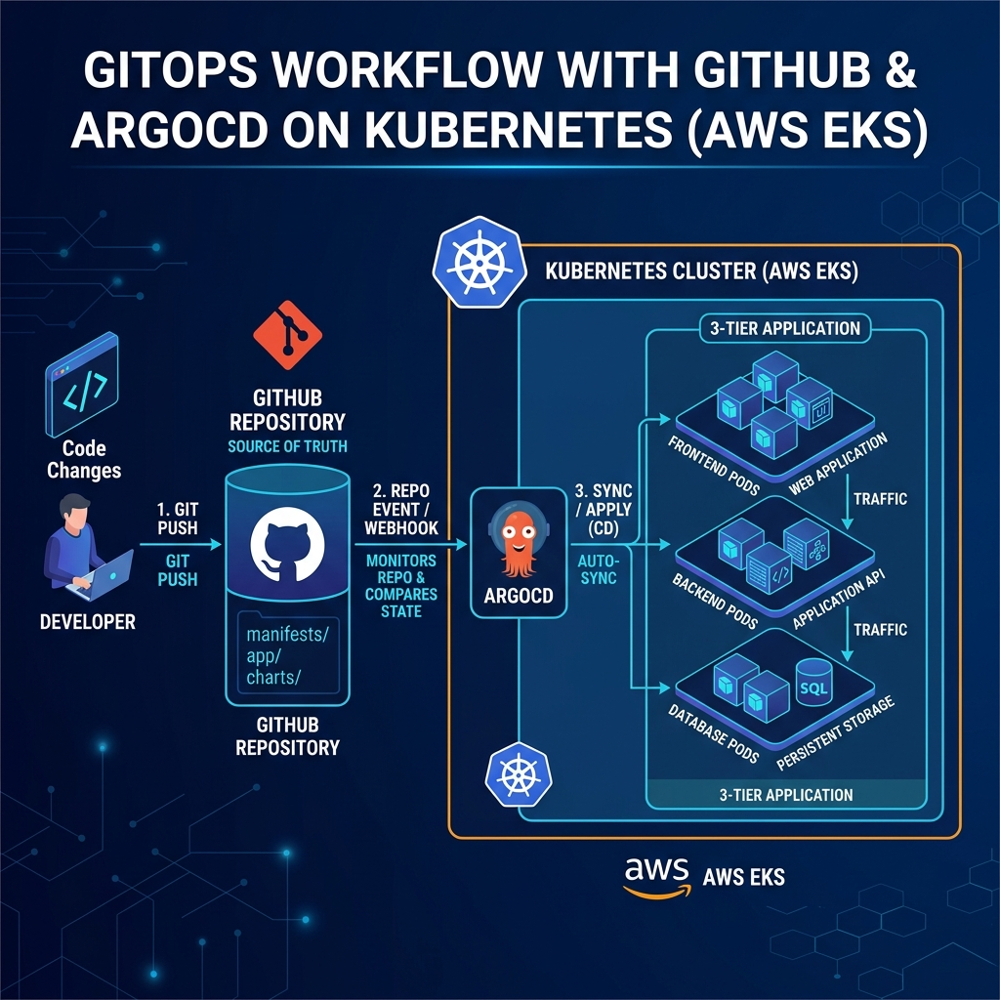

# GitOps AWS EKS Terraform Deployment



This repository contains everything you need to automatically provision a production-ready AWS EKS cluster and configure a fully automated GitOps workflow using ArgoCD for a 3-tier web application.

## 🗂️ Repository Structure

This project follows a streamlined "Infrastructure + Deployments" repository pattern, acting as the single source of truth for both the AWS cluster and the Kubernetes workloads.

```text
/
├── terraform/                # AWS EKS Infrastructure as Code
└── manifests/                # Kubernetes Configurations
    ├── argocd-app.yaml       # Master ArgoCD App definition
    └── application/          # The actual 3-tier application manifests
        ├── backend.yaml      # Backend Deployment & Service
        ├── frontend.yaml     # Frontend Deployment & Service
        ├── postgres.yaml     # DB Deployment, PVC & Service
        ├── secret.yaml       # DB Credentials
        └── kustomization.yaml# Kustomize orchestration
```

## 🏗️ Infrastructure Architecture (Terraform)

The infrastructure is provisioned using **Terraform** and includes:
- **VPC** with Public and Private subnets spanning across 3 Availability Zones.
- **NAT Gateway** for secure outbound internet access from private subnets.
- **AWS EKS Cluster** (`gitops-eks-cluster`) deployed securely in private subnets.
- **EKS Managed Node Group** running `t3.medium` instances.
- **EBS CSI Driver** Addon configured with IAM Roles for Service Accounts (IRSA) to enable persistent storage for databases.
- **ArgoCD** deployed into the `argocd` namespace, automatically exposed via an AWS Classic LoadBalancer.

## 🔄 The GitOps Workflow

This setup implements a true GitOps pipeline using **ArgoCD**:

1. **Commit & Push**: A developer (you) modifies the Kubernetes manifests inside `manifests/application/` and pushes the changes to this repository.
2. **ArgoCD Polling**: ArgoCD, running inside your EKS cluster, continuously monitors the `manifests/application` folder in this GitHub repository.
3. **Automated Sync**: Upon detecting a change, ArgoCD immediately syncs the cluster state to match the desired state defined in your GitHub repository.
4. **Self-Healing**: If anyone manually modifies a resource in the cluster directly via `kubectl`, ArgoCD will automatically detect the drift and revert it back to the state defined in Git.

## 🚀 Deployment Instructions

### Prerequisites
- AWS CLI configured with appropriate credentials (`aws configure`).
- Terraform CLI (>= 1.5.0) installed.
- `kubectl` installed.

### 1. Provision the Infrastructure
Ensure you are in the `terraform/` directory and apply the configuration:

```bash
cd terraform
terraform init
terraform apply -auto-approve
```

*Note: AWS EKS cluster provisioning takes approximately 15 minutes.*

### 2. Connect to the Cluster
Once Terraform successfully completes, update your local kubeconfig to interact with the cluster:
```bash
aws eks update-kubeconfig --region us-east-1 --name gitops-eks-cluster
```

### 3. Deploy the ArgoCD Application
To kick off the GitOps synchronization, apply the root ArgoCD manifest. This tells ArgoCD to start watching the `manifests/application/` directory.
```bash
# Return to the root directory
cd ..
kubectl apply -f manifests/argocd-app.yaml
```

### 4. Access the ArgoCD UI
ArgoCD is exposed via a LoadBalancer. Get the URL by running:
```bash
kubectl get svc argocd-server -n argocd -o wide
```

Retrieve the initial admin password:
```powershell
# On Windows PowerShell
kubectl -n argocd get secret argocd-initial-admin-secret -o jsonpath="{.data.password}" | ForEach-Object { [System.Text.Encoding]::UTF8.GetString([System.Convert]::FromBase64String($_)) }

# On Linux/Mac
kubectl -n argocd get secret argocd-initial-admin-secret -o jsonpath="{.data.password}" | base64 -d
```
Log in using the username `admin` and the decrypted password. You will see your 3-tier application syncing and deploying automatically!

## 🔒 Security Best Practices

To ensure maximum security of your AWS environment, the following measures are actively enforced:
1. **Private EKS Nodes**: EKS worker nodes are placed entirely in private subnets, completely inaccessible from the public internet directly.
2. **IAM Roles for Service Accounts (IRSA)**: The EBS CSI driver operates using least-privilege IAM roles mapped to Kubernetes ServiceAccounts, avoiding the need to attach broad EC2 instance profiles to nodes.
3. **S3 Backend**: Terraform state is stored securely in an remote S3 bucket rather than locally.
4. **Git Ignore Protections**: This repository explicitly ignores `.terraform/`, `*.tfstate`, `*.tfplan`, and `*.tfvars` files to ensure sensitive AWS access keys, tokens, or infrastructure state are **never** accidentally pushed to GitHub.
